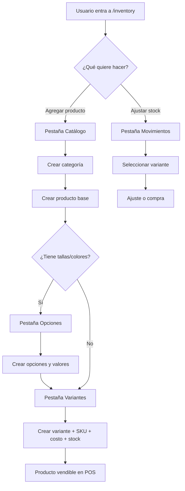

# Inventario MiNegocioCR — Especificación actual y brief para rediseño UX (v1)

> **Implementación:** el diseño aprobado, wireframes y plan de sprints están en **[INVENTARIO_UX_REDISENO_v2.md](./INVENTARIO_UX_REDISENO_v2.md)**. Este v1 conserva el análisis del estado actual y el brief original para Chat.

**Documento para:** Chat / diseño de producto / rediseño de interfaz  
**Fecha:** Junio 2026  
**Proyecto:** MiNegocioCR — plataforma multi-tenant para negocios en Costa Rica  
**Stack:** Angular 21 (frontend) + .NET 8 API + PostgreSQL  
**Estado del backend:** Implementado y en producción  
**Estado del frontend:** Funcional pero **difícil de usar** — necesita rediseño UX sin romper reglas de negocio

---

## Índice

1. [Objetivo de este documento](#1-objetivo-de-este-documento)
2. [Contexto del negocio y del usuario](#2-contexto-del-negocio-y-del-usuario)
3. [Modelo de datos (cómo piensa el sistema)](#3-modelo-de-datos-cómo-piensa-el-sistema)
4. [Flujo actual en la UI (paso a paso)](#4-flujo-actual-en-la-ui-paso-a-paso)
5. [Pantallas y componentes actuales](#5-pantallas-y-componentes-actuales)
6. [API disponible (contrato completo)](#6-api-disponible-contrato-completo)
7. [Reglas de negocio que la UI debe respetar](#7-reglas-de-negocio-que-la-ui-debe-respetar)
8. [Cálculo de precios (CRC)](#8-cálculo-de-precios-crc)
9. [Integración con otros módulos](#9-integración-con-otros-módulos)
10. [Problemas y fricciones (feedback real + análisis técnico)](#10-problemas-y-fricciones-feedback-real--análisis-técnico)
11. [Casos de uso que debemos cubrir](#11-casos-de-uso-que-debemos-cubrir)
12. [Restricciones y límites técnicos](#12-restricciones-y-límites-técnicos)
13. [Brecha backend vs. lo que el usuario espera](#13-brecha-backend-vs-lo-que-el-usuario-espera)
14. [Brief para el rediseño (qué pedimos a Chat)](#14-brief-para-el-rediseño-qué-pedimos-a-chat)
15. [Referencias de código y documentación](#15-referencias-de-código-y-documentación)

---

## 1. Objetivo de este documento

MiNegocioCR ya tiene un **módulo de inventario completo a nivel de API**, pero la interfaz actual es **engorrosa, fragmentada y orientada a pruebas técnicas**, no a un dueño de negocio que quiere «agregar un producto rápido».

Este MD consolida:

- Cómo funciona inventario **hoy** (modelo, API, pantallas).
- Qué puede reutilizarse **sin tocar backend** (ideal).
- Qué reglas **no se pueden violar** (stock, precios, variantes).
- Qué **duele** al usuario y por qué.

**Entregable esperado de Chat:** propuesta de nueva experiencia (flujos, wireframes conceptuales, estructura de pantallas, simplificación de pasos) usando **lo que ya existe en API**, indicando solo si hace falta algún endpoint nuevo.

---

## 2. Contexto del negocio y del usuario

| Aspecto | Detalle |
|---------|---------|
| **Usuario típico** | Dueño o empleado de tienda/reparaciones/ventas en Costa Rica |
| **Moneda** | Colones (₡). Precios de venta redondeados al **₡5 superior** |
| **IVA** | Configurable por negocio (`TaxRatePercent` en configuración) |
| **Margen** | Margen de ganancia por defecto del negocio + override opcional por variante |
| **Multi-tenant** | Cada negocio (`BusinessId`) ve solo su catálogo |
| **Tipos de ítem** | **Producto** (con stock) y **Servicio** (sin stock, se vende como línea libre) |
| **Uso real** | Inventario alimenta **Ventas (POS)**, **Reparaciones** (repuestos), **Créditos** (cargos con inventario) |
| **No conectado** | **Pedidos Internet** (compras Amazon/proxy) — catálogo separado, sin `CatalogVariantId` |

### Lo que el usuario quiere (en sus palabras)

> «Inventario es difícil de manejar. No me gusta cómo se agregan las cosas. Resulta muy difícil y engorroso.»

Traducción a requisitos UX:

- Menos pasos para «tener algo vendible en caja».
- Menos conceptos técnicos (GUIDs, tabs separados, opciones vs. valores vs. variantes).
- Flujo guiado, no manual entre 6 secciones.
- Pantalla principal que sirva para **trabajar**, no para «probar el backend».

---

## 3. Modelo de datos (cómo piensa el sistema)

No existe una entidad `Product` simple. El inventario es una **jerarquía de catálogo**:

```
Negocio (Business)
 └── Categoría (CatalogCategory)          ej. "Celulares", "Accesorios"
      └── Producto base (CatalogItem)     ej. "Funda iPhone 15"
           ├── Opción (CatalogOption)      ej. "Color", "Tamaño"  [opcional]
           │    └── Valor (CatalogOptionValue)  ej. "Negro", "Azul", "M"
           └── Variante (CatalogVariant)   ← LO QUE SE VENDE Y TIENE STOCK
                ├── SKU (opcional pero UI lo exige)
                ├── CostPrice, Price (venta)
                ├── StockQuantity
                ├── ProfitMargin (opcional)
                ├── Combinación de valores (CatalogVariantOptionValue) [opcional]
                └── Imágenes (hasta 3 por variante, Supabase)
```

### Entidad vendible = **Variante**

- En **Ventas**, **Créditos** y **Reparaciones** (al facturar) se referencia `CatalogVariantId`.
- El **stock** vive en `CatalogVariant.StockQuantity`.
- Los movimientos se auditan en `InventoryMovement` (compra, venta, ajuste).

### Campos en `CatalogItem` poco usados en práctica

| Campo | Significado | Problema |
|-------|-------------|----------|
| `HasVariants` | Si el ítem usa variantes | **Persistido pero no enforced** |
| `TrackStock` | Si se controla inventario | **Persistido pero no enforced** — cualquier venta con `CatalogVariantId` baja stock igual |
| `BasePrice` | Precio base del ítem | Usado al crear; la venta real usa precio de **variante** |

### Servicios vs. productos

- **Servicio** (`CatalogItemType.Service = 2`): típicamente **sin variantes**; en ventas/reparaciones se usa línea con `Description` libre, sin `CatalogVariantId`.
- **Producto** (`CatalogItemType.Product = 1`): necesita al menos **una variante** para venderse desde POS con stock.

---

## 4. Flujo actual en la UI (paso a paso)

**Ruta única:** `/inventory` → componente `Products` con **6 pestañas internas** (no son rutas Angular).

### Para agregar UN producto vendible con stock (camino completo)

| Paso | Pestaña | Acción del usuario | API |
|------|---------|-------------------|-----|
| 1 | **Catálogo** | Crear categoría (si no existe) | `POST /api/categories` |
| 2 | **Catálogo** | Crear «producto base»: nombre, precio base, tipo, categoría, track stock | `POST /api/catalog` |
| 3 | **Opciones** | Seleccionar producto → crear opción «Color» | `POST /api/options` |
| 4 | **Opciones** | Crear valores «Negro», «Azul» | `POST /api/option-values` |
| 5 | **Opciones** | (Repetir 3–4 para «Tamaño» → «M», «L») | — |
| 6 | **Variantes** | Seleccionar producto → llenar SKU, costo, margen, stock inicial | — |
| 7 | **Variantes** | Elegir combinación en multi-select plano de todos los valores | — |
| 8 | **Variantes** | (Opcional) subir hasta 3 imágenes | — |
| 9 | **Variantes** | Crear variante | `POST /api/variants` + `POST .../images` |

**Mínimo sin opciones:** pasos 1–2 + 6–9 (aún **3 pestañas** y muchos campos).

### Para ajustar stock después

| Paso | Pestaña | Acción |
|------|---------|--------|
| 1 | **Stock y movimientos** | Buscar y seleccionar producto base |
| 2 | | Elegir variante en tabla (modo selección) |
| 3 | | Ajuste manual (+/-) con motivo **o** registrar compra con líneas |

### Para solo consultar

- Pestaña **Ver inventario**: tablas de solo lectura con búsqueda global (carga pesada: N+1 por producto).

### Diagrama del flujo actual



---

## 5. Pantallas y componentes actuales

### Página principal

| Elemento | Archivo | Notas |
|----------|---------|-------|
| Hub inventario | `mi-negociocr-frontend/src/app/features/inventory/pages/products/products.ts` (~1.285 líneas) | Monolito que orquesta todo |
| Template | `products/products.html` | Hero dice «probar el backend real» |
| Estilos | `products/products.scss` | |

### Pestañas (`activeSection`)

| ID | Título UI | Contenido |
|----|-----------|-----------|
| `overview` | Resumen | Tutorial de 5 pasos |
| `catalog` | Catálogo | Categorías + form crear producto + tabla CRUD productos base |
| `options` | Opciones | Dos columnas: opciones (izq) + valores (der) |
| `variants` | Variantes | Form crear variante + tabla variantes |
| `movements` | Stock y movimientos | Selección variante + ajuste + compras |
| `browse` | Ver inventario | Vista global solo lectura |

### Componentes hijos

| Componente | Ruta | Función |
|------------|------|---------|
| `CategoriesManagement` | `components/categories-management/` | CRUD categorías inline |
| `CatalogItemsManagement` | `components/catalog-items-management/` | Tabla + edición inline productos base |
| `OptionsManagement` | `components/options-management/` | CRUD opciones |
| `OptionValuesManagement` | `components/option-values-management/` | CRUD valores (depende de `@Output` del panel izquierdo) |
| `VariantsManagement` | `components/variants-management/` | Lista, editar, eliminar variantes |
| `VariantEditDialog` | `components/variant-edit-dialog.ts` | Modal: SKU, costo, margen, precio, imágenes |
| `VariantItemImagesComponent` | `components/variant-item-images/` | Subida imágenes (draft / persisted) |
| `InventoryTextEditDialog` | `components/inventory-text-edit-dialog.ts` | Editar nombre opción/valor |

### Código muerto (confunde mantenimiento)

| Archivo | Estado |
|---------|--------|
| `pages/create-product/` | Mock en memoria; ruta redirige a `/inventory` |
| `pages/edit-product/` | Mock en memoria; ruta redirige a `/inventory` |
| `services/product.service.ts` | Mock; no lo usa la UI viva |

### Formularios y validaciones actuales

#### Crear producto base (`catalogForm`)

| Campo UI | API | Validación |
|----------|-----|------------|
| Nombre | `name` | Requerido, máx. 100 |
| Precio base | `basePrice` | Requerido, ≥ 0 |
| Tipo | `type` | Producto (1) o Servicio (2) |
| Categoría | `categoryId` | **Requerido** — bloqueado si no hay categorías |
| Controlar inventario | `trackStock` | Checkbox, default true |

#### Crear variante (`variantForm`)

| Campo UI | API | Validación |
|----------|-----|------------|
| Producto base | `catalogItemId` | Requerido |
| SKU | `sku` | **Requerido**, máx. 80 |
| Costo | `costPrice` | **Requerido, > 0** |
| Margen % | `profitMarginPercent` | Opcional; default del negocio |
| Precio venta | `price` | **Solo lectura** (calculado) |
| Stock inicial | `initialStock` | Requerido, ≥ 0 |
| Opciones | `optionValueIds[]` | Requerido si el producto tiene opciones |
| Imágenes | multipart | Máx. 3, 5 MB, png/jpeg |

#### Ajuste de stock

| Campo | Validación |
|-------|------------|
| Ajuste | ≠ 0 |
| Motivo | Requerido, máx. 200 caracteres |

#### Compra (entrada de stock)

| Campo | Validación |
|-------|------------|
| Cantidad | ≥ 1 |
| Costo unitario | ≥ 0.01 |

### Patrones UX actuales

- Pestañas con botones `mat-stroked-button` (no `MatTabGroup`).
- Tablas HTML simples (no `MatTable`).
- `window.confirm` para eliminar (inconsistente con Material en otros módulos).
- `MatSnackBar` para éxito/error.
- IDs técnicos visibles en tablas (`<code>{{ id }}</code>`).
- Sin wizard, sin progreso, sin deep links a un producto.

---

## 6. API disponible (contrato completo)

Base: `/api` · Autenticación: JWT Bearer · `businessId` en body, query o claims según endpoint.

Documento técnico complementario: `docs/Inventory-API-Handoff.md`

### Catálogo — `/api/catalog`

| Método | Ruta | Descripción |
|--------|------|-------------|
| GET | `/catalog/{businessId}?includeInactive` | Listar productos base |
| GET | `/catalog/mine?includeInactive` | Igual; `businessId` del JWT |
| POST | `/catalog` | Crear producto base → `Guid` |
| PUT | `/catalog/{id}` | Actualizar |
| PATCH | `/catalog/{id}/toggle` | Activar/desactivar |
| DELETE | `/catalog/{id}?businessId=` | Soft-delete si **no tiene variantes** |

### Categorías — `/api/categories`

| Método | Ruta |
|--------|------|
| GET | `/categories/{businessId}?includeInactive` |
| POST | `/categories` |
| PUT | `/categories/{id}` |
| PATCH | `/categories/{id}/toggle` |
| DELETE | `/categories/{id}?businessId=` |

### Opciones — `/api/options`

| Método | Ruta |
|--------|------|
| GET | `/options/{catalogItemId}?includeInactive` |
| POST | `/options` |
| PUT | `/options/{id}` |
| PATCH | `/options/{id}/toggle` |
| DELETE | `/options/{id}` |

### Valores de opción — `/api/option-values`

| Método | Ruta |
|--------|------|
| GET | `/option-values/{optionId}?includeInactive` |
| POST | `/option-values` |
| PUT | `/option-values/{id}` |
| PATCH | `/option-values/{id}/toggle` |
| DELETE | `/option-values/{id}` |

### Variantes — `/api/variants`

| Método | Ruta | Notas |
|--------|------|-------|
| GET | `/variants/{catalogItemId}?businessId=` | Variantes de un producto |
| GET | `/variants/business/{businessId}?catalogItemId=&search=` | Búsqueda global (usado en POS) |
| POST | `/variants` | Crear → `Guid` |
| PUT | `/variants/{id}` | Actualizar SKU, costo, margen, precio — **no cambia stock** |
| DELETE | `/variants/{id}?businessId=` | Solo si sin ventas/compras (salvo stock inicial) |
| POST | `/variants/{variantId}/images?businessId=` | Multipart, máx. 3 |
| GET | `/variants/{variantId}/images?businessId=` | Listar imágenes |
| DELETE | `/variants/images/{imageId}?businessId=` | |
| PATCH | `/variants/images/{imageId}/primary?businessId=` | Marcar principal |

**DTO respuesta lista (`CatalogVariantListItemDto`):** `sku`, `price`, `costPrice`, `profitMargin`, `effectiveProfitMargin`, `initialStock`, `currentStock`, `optionValueIds`, `optionValueLabels`, `createdAt`.

### Inventario — `/api/inventory`

| Método | Ruta | Body |
|--------|------|------|
| POST | `/inventory/adjust` | `{ businessId, variantId, adjustment, reason }` |

### Compras — `/api/purchases`

| Método | Ruta | Body |
|--------|------|------|
| POST | `/purchases` | `{ businessId, items: [{ variantId, quantity, cost }] }` |

### Ventas (baja stock automática) — `/api/sales`

No es pantalla de inventario, pero **consume variantes**. `POST /api/sales` con líneas `CatalogVariantId` + `ItemType=Product`.

### Lo que **no** existe en API hoy

| Necesidad posible | Estado |
|-------------------|--------|
| GET historial de movimientos por variante | ❌ No hay endpoint |
| Crear producto + variante en un solo POST | ❌ Pasos separados |
| Crear opciones/valores en batch | ❌ Uno por request |
| SKU opcional en UI pero API lo permite opcional | ⚠️ API: SKU opcional; UI lo exige |
| Wizard «producto simple» sin opciones | ⚠️ Solo composición de calls existentes |

---

## 7. Reglas de negocio que la UI debe respetar

### Variantes

1. **SKU** único por producto base (case-insensitive). Puede ir vacío en API; la UI actual lo exige.
2. **Combinación de opciones** única por producto. No repetir el mismo set de `optionValueIds`.
3. **Una variante sin opciones** permitida por producto (variante «default»).
4. Todos los `optionValueIds` deben pertenecer al mismo `catalogItemId`.
5. **Eliminar variante** bloqueado si tiene ventas, compras o movimientos distintos de stock inicial.
6. **Actualizar variante** no modifica cantidad en stock — solo SKU, costos y precio.

### Stock

1. **Stock inicial** al crear variante: se setea `StockQuantity` y se registra movimiento tipo `Purchase` con nota `"Initial stock"`.
2. **Ajuste manual:** `adjustment ≠ 0`; positivo suma, negativo resta.
3. **Compra:** suma stock vía `IncreaseStockAsync`.
4. **Venta / crédito / factura reparación:** resta stock; error si stock insuficiente.
5. **Alerta stock bajo:** cuando `StockQuantity <= LowStockThreshold` (default 2) — hoy solo log en consola del servidor.

### Catálogo

1. **Eliminar producto base** solo si no tiene variantes.
2. Desactivar producto no elimina variantes.

### Imágenes

- Máximo **3** por variante.
- Tamaño máximo **5 MB**.
- Formatos: PNG, JPEG.
- Una imagen **principal** (`isPrimary`).

---

## 8. Cálculo de precios (CRC)

La UI calcula precio de venta desde **costo + margen + IVA** (config del negocio en `/settings/business`).

### Fórmula (simplificada)

```
ganancia = costPrice × (profitMargin% / 100)
subtotal = costPrice + ganancia
precio_con_iva = subtotal × (1 + taxRate% / 100)
precio_final = redondeo CRC (ceil al ₡5 superior)
```

### Implementación frontend

- `utils/variant-sale-price.ts`
- `BusinessConfigService` → `defaultProfitMargin`, `taxRatePercent`
- El API también recalcula/normaliza al persistir (`CatalogVariantPriceResolver` + `CrcSalePriceNormalizer`)

### UX actual

- Campo precio de venta **readonly** al crear variante.
- Panel «desglose» muestra costo → ganancia → IVA → precio cliente.
- Snackbar si el precio sube por redondeo a ₡5.

**Doc:** `docs/crc-sale-price-rounding.md`

---

## 9. Integración con otros módulos

| Módulo | Cómo usa inventario |
|--------|---------------------|
| **Ventas (POS)** | `GET /variants/business/{id}?search=` — buscar por nombre/SKU; carrito con `CatalogVariantId`; baja stock al registrar venta |
| **Reparaciones** | Agregar repuesto opcional con `CatalogVariantId`; stock baja al **facturar** reparación (no al crear orden) |
| **Créditos** | Líneas `LineKind=Inventory` con `CatalogVariantId`; baja stock al confirmar cargo |
| **Dashboard** | Top productos por ingresos (`SaleItems` → variantes) |
| **WhatsApp AI** | Tool `inventory_search` — búsqueda fuzzy de variantes |
| **Pedidos Internet** | **Sin vínculo** — productos en texto libre USD |

### Servicios frontend compartidos

Otros módulos importan de `features/inventory/`:

- `VariantSummary` (modelo)
- `VariantsService` / búsqueda
- `variant-stock.util.ts`, `variant-sale-price.ts`

**Cualquier rediseño debe mantener** la capacidad de buscar variantes para POS, créditos y reparaciones.

---

## 10. Problemas y fricciones (feedback real + análisis técnico)

### Del usuario

| # | Problema |
|---|----------|
| U1 | Agregar productos es **demasiado difícil** |
| U2 | El flujo es **engorroso** — muchos pasos y pantallas |
| U3 | No le gusta la experiencia general |

### Del análisis del código / UX

| # | Problema | Impacto |
|---|----------|---------|
| T1 | **6 pestañas** sin flujo guiado | Usuario no sabe por dónde empezar ni cuándo terminó |
| T2 | Conceptos expuestos: producto base vs. variante vs. opción vs. valor | Curva de aprendizaje alta |
| T3 | **Monolito** `products.ts` (~1.300 líneas) | Difícil evolucionar UX |
| T4 | Hero copy: «probar el backend» | Sensación de herramienta interna, no producto |
| T5 | **GUIDs visibles** en tablas | Ruido visual, sensación técnica |
| T6 | Multi-select **plano** de valores de opción | No hay un dropdown por dimensión (Color, Talla); fácil equivocarse |
| T7 | **Duplicación**: form crear producto + tabla CRUD en misma pestaña | Confuso |
| T8 | Opciones/valores en **dos columnas** con dependencia implícita | Si no cargaste opciones, panel derecho vacío |
| T9 | Stock en pestaña **separada** de variantes | Ajustar stock requiere cambiar de tab y re-seleccionar |
| T10 | **SKU obligatorio** en UI aunque API permite omitir | Fricción para productos simples |
| T11 | **Costo > 0 obligatorio** | No hay camino «solo precio de venta manual» sin costo en create (aunque edit dialog permite más flexibilidad) |
| T12 | `window.confirm` vs. Material dialogs | Inconsistente con resto de la app |
| T13 | Vista «Ver inventario» hace **N+1 requests** | Lenta con muchos productos |
| T14 | Cache `localStorage` en `CatalogService` | Riesgo de datos desactualizados |
| T15 | Código legacy (`create-product`, mock) | Confusión para quien mantiene el repo |

---

## 11. Casos de uso que debemos cubrir

Prioridad para el rediseño (**P1 = esencial**).

| ID | Caso | Prioridad | Notas |
|----|------|-----------|-------|
| CU1 | Agregar producto **simple** (nombre, precio, stock, categoría) sin variantes | **P1** | Hoy: 3 pestañas mínimo |
| CU2 | Agregar producto **con variantes** (ej. color/talla) | **P1** | Hoy: 4–5 pestañas |
| CU3 | Buscar producto/variante en inventario | **P1** | Existe en tab «Ver inventario» pero apartada |
| CU4 | Editar precio, costo, SKU de variante | **P1** | Modal `VariantEditDialog` |
| CU5 | Ajustar stock (+/-) con motivo | **P1** | Hoy en tab Movimientos |
| CU6 | Registrar entrada por compra | P2 | Tab Movimientos |
| CU7 | Subir/cambiar fotos de producto | P2 | Hasta 3 imágenes |
| CU8 | Gestionar categorías | P2 | Necesario antes de crear productos |
| CU9 | Activar/desactivar producto o categoría | P2 | — |
| CU10 | Ver stock bajo / alertas | P3 | Backend solo log; UI no muestra alertas centralizadas |
| CU11 | Historial de movimientos | P3 | **Sin API** — habría que agregar endpoint o posponer |
| CU12 | Agregar **servicio** (sin stock) | P2 | Tipo Servicio; venta como línea libre |
| CU13 | Eliminar producto/variante (con reglas) | P2 | Confirmaciones claras |

### Personas

| Persona | Necesidad principal |
|---------|---------------------|
| **Dueño de tienda** | «Metí 20 fundas nuevas en 2 minutos» |
| **Técnico de reparaciones** | Buscar repuesto, ver si hay stock |
| **Cajero** | No usa inventario directo — usa POS (pero depende de catálogo bien cargado) |

---

## 12. Restricciones y límites técnicos

| Restricción | Detalle |
|-------------|---------|
| **Preferencia** | Rediseño **solo frontend** reutilizando API actual |
| **Framework** | Angular 21 standalone, Angular Material, RxJS |
| **Estilo visual** | Coherente con MiNegocioCR (verde/teal, cards redondeadas, sidebar) — ver módulos Ventas, Créditos, Dashboard |
| **Multi-tenant** | Siempre filtrar por `businessId` de sesión |
| **Precios** | Mantener lógica CRC ₡5 y desglose IVA/margen |
| **No romper** | Búsqueda de variantes en POS, créditos, reparaciones |
| **Pantallas pequeñas** | Menú lateral colapsable ya implementado (jun 2026) |
| **Idioma UI** | Español (Costa Rica) |

---

## 13. Brecha backend vs. lo que el usuario espera

| Expectativa usuario | Realidad API | Posible solución UX |
|---------------------|--------------|-------------------|
| «Un formulario, un producto» | 2–5 entidades (categoría, item, opciones, variante) | Wizard que encadena calls; o «modo simple» que crea item + variante default en secuencia |
| «SKU opcional» | API lo permite | Quitar `required` en form simple |
| «Solo precio de venta» | API acepta `price` manual (`SetPriceManually`) | Modo «precio fijo» vs. «desde costo» |
| «Ver historial de movimientos» | Sin GET | Endpoint nuevo (futuro) o omitir en v1 |
| «Alertas stock bajo» | Solo log servidor | Lista filtrada `currentStock <= threshold` con datos existentes |
| «Editar stock directo en tabla» | Solo vía adjust/purchase | Botón +/- que llama `POST /inventory/adjust` |

### Endpoints nuevos (solo si Chat lo recomienda y justifica)

| Endpoint hipotético | Beneficio |
|---------------------|-----------|
| `POST /api/catalog/quick-product` | Item + variante default en una transacción |
| `GET /api/inventory/movements?variantId=` | Historial |
| `GET /api/variants/business/{id}?lowStockOnly=true` | Alertas |

---

## 14. Brief para el rediseño (qué pedimos a Chat)

### Objetivo

Diseñar una **interfaz de inventario amigable** para dueños de negocio en Costa Rica, usando el **backend existente** (salvo mejoras justificadas).

### Preguntas para Chat

1. **¿Cómo simplificar el flujo «agregar producto» a 1–2 pantallas** (o un wizard de 3 pasos máximo)?
2. **¿Cómo ocultar la complejidad** de opciones/variantes al usuario que solo quiere un producto simple?
3. **¿Cuál debería ser la pantalla principal** al entrar a `/inventory`? (lista de productos vendibles, no tutorial)
4. **¿Cómo integrar stock, precio e imágenes** en la misma vista de detalle de producto?
5. **¿Cómo manejar variantes** (color/talla) con UX clara — un selector por dimensión, no multi-select plano?
6. **¿Qué eliminar o fusionar** de las 6 pestañas actuales?
7. **Mobile / pantallas pequeñas:** ¿qué priorizar?

### Entregables esperados de Chat

- [ ] Propuesta de **árbol de navegación** nuevo (rutas sugeridas)
- [ ] **Flujos** para CU1–CU6 (diagramas o pasos numerados)
- [ ] **Wireframes en texto** (secciones, campos, botones, copy en español)
- [ ] Matriz **antes/después** (pasos actuales vs. propuestos)
- [ ] Lista de **cambios solo UI** vs. **cambios API** opcionales
- [ ] Recomendación de **MVP** (qué implementar primero)

### Principios deseados

- **Vendible rápido:** en pocos clics el producto aparece en POS.
- **Progresivo:** modo simple por defecto; variantes/opciones como «avanzado».
- **Una sola lista principal** de lo que el negocio vende (variantes con nombre de producto + etiquetas de opción).
- **Acciones frecuentes visibles:** editar precio, ajustar stock, buscar.
- **Sin jerga técnica:** no mostrar GUIDs; copy humano.
- **Coherente** con módulos Ventas y Créditos (misma búsqueda de productos).

### Anti-patrones a evitar

- 6 pestañas horizontales sin contexto.
- Formularios duplicados en la misma vista.
- Depender de que el usuario entienda «producto base» vs. «variante» antes de empezar.
- Pantalla de «Resumen» como primera impresión.

---

## 15. Referencias de código y documentación

### Frontend (mi-negociocr-frontend)

| Recurso | Ruta |
|---------|------|
| Página inventario | `src/app/features/inventory/pages/products/` |
| Modelos | `src/app/features/inventory/models/inventory.models.ts` |
| Servicios | `src/app/features/inventory/services/*.ts` |
| Precio CRC | `src/app/features/inventory/utils/variant-sale-price.ts` |
| Rutas | `src/app/app.routes.ts` → `/inventory` |
| Consumo en POS | `src/app/features/sales/pages/sales-manual/` |

### Backend (MiNegocioCR.Api)

| Recurso | Ruta |
|---------|------|
| Entidades | `Domain/Entities/Catalog*.cs`, `InventoryMovement.cs` |
| Stock | `Infrastructure/Services/InventoryService.cs` |
| Crear variante | `Application/UseCases/Repository/CreateVariantUseCase.cs` |
| Precios | `Application/Common/CatalogVariantPriceResolver.cs` |
| Controllers | `API/Controllers/CatalogController.cs`, `VariantController.cs`, `InventoryController.cs`, etc. |
| Handoff API | `docs/Inventory-API-Handoff.md` |
| Redondeo CRC | `docs/crc-sale-price-rounding.md` |

### Otros docs relacionados

| Doc | Tema |
|-----|------|
| `REFACTOR_REPAIR_PAYMENTS_SALES.md` | Ventas y reparaciones |
| `CREDITOS_CUENTAS_COBRAR_DISENO_v1.md` | Líneas de inventario en créditos |

---

## Apéndice A — Ejemplo concreto: «Funda iPhone»

### Hoy (usuario impaciente)

1. Ir a Inventario → Catálogo → crear categoría «Accesorios».
2. Crear producto base «Funda iPhone 15».
3. Ir a Opciones → crear «Color» → valores «Negro», «Azul».
4. Ir a Variantes → seleccionar producto → SKU `FUNDA-NEG` → costo ₡2.000 → stock 10 → marcar «Negro» → crear.
5. Repetir paso 4 para «Azul» (`FUNDA-AZU`).
6. Recién ahí aparece en Ventas.

### Objetivo rediseño (ejemplo ilustrativo)

1. Inventario → **«Agregar producto»**.
2. Nombre, categoría, ¿tiene colores/tallas? → si sí, agregar en el mismo formulario.
3. Costo, margen o precio final, stock, foto.
4. **Guardar** → listo para vender.

*(Chat debe proponer cómo lograr esto con los endpoints actuales o qué endpoint agregar.)*

---

## Apéndice B — Resumen de entidades API (JSON)

### Crear producto base

```json
POST /api/catalog
{
  "businessId": "GUID",
  "name": "Funda iPhone 15",
  "basePrice": 0,
  "trackStock": true,
  "type": 1,
  "categoryId": "GUID_CATEGORIA"
}
```

### Crear variante simple (sin opciones)

```json
POST /api/variants
{
  "catalogItemId": "GUID_ITEM",
  "sku": "FUNDA-IPH15",
  "costPrice": 2000,
  "price": 3500,
  "initialStock": 10,
  "optionValueIds": [],
  "profitMarginPercent": 30
}
```

### Ajustar stock

```json
POST /api/inventory/adjust
{
  "businessId": "GUID",
  "variantId": "GUID_VARIANTE",
  "adjustment": -2,
  "reason": "Conteo físico — faltante"
}
```

---

*Documento v1 — Junio 2026 · MiNegocioCR · Para rediseño UX con Chat*
