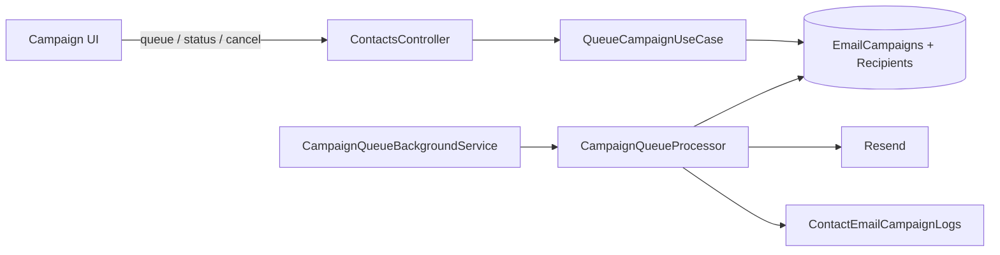

# Campañas de correo CRM (cola global)

Documentación de la funcionalidad **Clientes → Campaña de correo**: audiencia por inactividad, cola global entre tenants, envío vía Resend y seguimiento en UI.

**Relacionado:** [FIXES_MAYO_2026.md](./FIXES_MAYO_2026.md) §26–28 · [RESEND_SETUP.md](../RESEND_SETUP.md) · [local-dev-database.md](./local-dev-database.md)

---

## Resumen

| Concepto | Valor / comportamiento |
|----------|------------------------|
| Ruta UI | `/customers/campaign` (frontend) |
| API base | `GET/POST /api/contacts/{businessId}/campaign/...` |
| Cupo diario global | **495** correos/día (todos los negocios) |
| Intervalo entre envíos | **60 s** (un destinatario por minuto en la cola global) |
| Audiencia default | Inactivos **60** días + sin marketing **60** días (`quietDays`) |
| Personalización | Placeholder `{nombre}` en asunto y cuerpo |
| Proveedor | Resend (`ResendEmailService` en producción) |

---

## Arquitectura



1. El usuario arma asunto/cuerpo/imagen y pide **vista previa** o **encolar**.
2. `QueueCampaignUseCase` crea `EmailCampaign` + filas `EmailCampaignRecipients` (`Pending`, orden global).
3. `CampaignQueueBackgroundService` invoca `CampaignQueueProcessor` cada pocos segundos.
4. El procesador reclama un destinatario (`Processing`), envía por Resend, marca `Sent`/`Failed`, escribe log y actualiza progreso de campaña.
5. La UI hace polling a `GET .../campaign/{id}/status` (cada ~10 s) y puede **Detener campaña**.

---

## Endpoints

| Método | Ruta | Uso |
|--------|------|-----|
| `GET` | `.../campaign/preview` | Conteo de audiencia, ETA, cupo restante |
| `POST` | `.../campaign/send` | Envío inmediato (legacy; un lote) |
| `POST` | `.../campaign/queue` | Encolar campaña (recomendado) |
| `GET` | `.../campaign/active` | Campaña activa del negocio (si hay) |
| `GET` | `.../campaign/{campaignId}/status` | Progreso: enviados, fallidos, pendientes |
| `POST` | `.../campaign/cancel` | Cancelar campaña (`?campaignId=` opcional) |
| `POST` | `.../campaign/upload-image` | Subir imagen a Supabase (cuerpo HTML) |

Autenticación: JWT del tenant; `businessId` en la ruta.

---

## Base de datos

### Migraciones

| Migración | Contenido |
|-----------|-----------|
| `20260527120000_AddContactLastActivityAt` | `Contacts.LastActivityAt` |
| `20260528120000_AddContactEmailCampaign` | `LastMarketingEmailAt`, `ContactEmailCampaignLogs` |
| `20260529120000_AddEmailCampaignQueue` | `EmailCampaigns`, `EmailCampaignRecipients` |

Aplicar con `dotnet ef database update` o secciones **5–7** de `Scripts/apply-pending-migrations.sql`.

### Estados

**Campaña (`EmailCampaigns.Status`):** `Queued`, `InProgress`, `Completed`, `Cancelled`.

**Destinatario (`EmailCampaignRecipients.Status`):** `Pending`, `Processing`, `Sent`, `Failed`, `Cancelled`.

`Processing` es solo un valor en `varchar(20)`; no requiere migración adicional.

### Scripts operativos

| Script | Cuándo usarlo |
|--------|----------------|
| `Scripts/cancel-active-campaigns.sql` | Emergencia: detener todas las campañas activas |
| `Scripts/investigate-campaign-duplicates.sql` | Diagnosticar logs duplicados / mismos correos |
| `Scripts/verify-schema.sql` | Post-deploy: tablas CRM + historial migraciones |
| `Scripts/apply-pending-migrations.sql` | Respaldo idempotente si EF no corrió |

---

## Reglas de contenido (anti-spam / deliverability)

Validadas en `CampaignContentValidator` antes de encolar o enviar:

| Campo | Regla |
|-------|--------|
| Asunto | Mínimo **8** caracteres “sustantivos” (sin contar solo espaces/puntuación) |
| Cuerpo texto | Mínimo **25** caracteres sustantivos |
| Cuerpo con imagen | Mínimo **10** caracteres sustantivos en texto |

HTML del correo (`CampaignEmailHtmlBuilder`):

- `lang="es"`
- Pie: *“Recibiste este correo porque sos cliente de …”*
- Imagen opcional desde URL de Supabase

Frontend: `campaign-content-rules.ts`, vista previa `campaign-email-preview.ts`, hints con `{nombre}` escapado en plantillas Angular.

---

## Deduplicación de destinatarios

`CampaignRecipientDeduplication` (en `QueueCampaignUseCase`):

- Un **email** no aparece dos veces en la misma campaña (aunque existan varios contactos CRM con el mismo correo).
- Reduce rebotes y percepción de spam cuando el CRM tiene duplicados.

---

## Cola y progreso (fixes importantes)

### Re-envío en bucle (incidente mayo 2026)

**Síntoma:** Una campaña con pocos destinatarios generaba decenas de correos al mismo inbox; en BD los destinatarios seguían `Pending` y `SentCount` en campaña no subía.

**Causa:** Tras enviar por Resend, un único `SaveChanges` fallaba o no persistía por `NoTracking` global → el worker volvía a tomar el mismo `Pending` (~1/min).

**Fix (`CampaignQueueProcessor`, `CampaignQueueProgress`, `GetCampaignStatusUseCase`):**

- Reclamo atómico con `ExecuteUpdate` → estado `Processing`.
- Marcar destinatario `Sent` **antes** del log aislado (`TryPersistCampaignLogAsync`).
- Progreso y estado de campaña calculados desde **conteo de destinatarios**, no solo columnas denormalizadas.
- API de status: `SentCount`/`FailedCount` desde recipients; `Completed` cuando `pendingCount == 0`.

### Cancelación

`POST .../campaign/cancel` + botón **Detener campaña** en UI. Cancela campaña activa y destinatarios `Pending`/`Processing`.

---

## Frontend

| Archivo | Rol |
|---------|-----|
| `features/customers/pages/campaign/campaign.ts` | Formulario, polling, cancelar |
| `customer-contacts.service.ts` | `queueCampaign`, `getCampaignStatus`, `cancelActiveCampaign` |
| `campaign-content-rules.ts` | Reglas espejo del validador API |
| `campaign-email-preview.ts` | Vista previa HTML |

Comportamiento UI:

- Polling cada **10 s** mientras hay campaña activa.
- Ocultar panel de progreso cuando `pendingCount === 0`.
- Validaciones en tiempo real + placeholder de cuerpo en TS (evita NG5002 con `{nombre}`).

---

## Límites y ETA

- Cupo restante del día: envíos exitosos en `ContactEmailCampaignLogs` + cola global.
- ETA en preview: `destinatarios × 60 s` (más tiempo si el cupo diario se agota al día siguiente).
- Si `sentToday >= 495`, el worker no envía hasta el día siguiente (UTC).

Constantes: `Application/Common/CampaignLimits.cs`.

---

## Verificación local

```powershell
cd MiNegocioCR.Api
dotnet test --filter ContactCampaign
dotnet test --filter CampaignContentValidator

cd ../mi-negociocr-frontend
npm run build
```

Smoke manual:

1. Clientes → Campaña → preview con audiencia > 0.
2. Encolar con asunto/cuerpo válidos → un correo cada ~60 s.
3. Status muestra pendientes bajando; al terminar, panel se libera.
4. **Detener campaña** deja de enviar nuevos correos.
5. Mismo email en dos contactos → **un solo** destinatario en la campaña.

---

## Emergencia en producción

Si los correos no paran:

```sql
-- Scripts/cancel-active-campaigns.sql
UPDATE "EmailCampaigns" SET "Status" = 'Cancelled', "CompletedAt" = NOW()
WHERE "Status" IN ('Queued', 'InProgress');

UPDATE "EmailCampaignRecipients" SET "Status" = 'Cancelled', ...
WHERE "Status" IN ('Pending', 'Processing');
```

Luego redeploy con el fix de cola si la versión en Railway es anterior a los commits de `CampaignQueueProcessor` / `CampaignQueueProgress`.

---

*Última actualización: 25 mayo 2026 — cola CRM, fix re-envío, cancelación, dedupe y validaciones*
